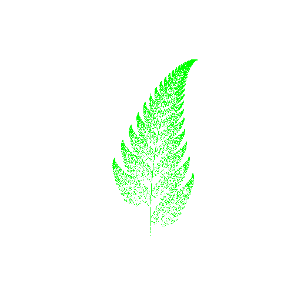
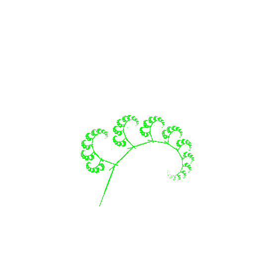
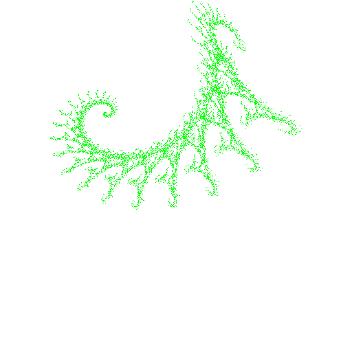

# Golang IFS Fractals

I was bored and wanted to learn some more golang. This is the result.

Credit to http://paulbourke.net/fractals/ifs/ for most of the formulas

## Examples

### fern.go



### stickfern.go



### dragon.go



## Usage

```sh
go get

go build
./go-fractal-ifs
```
